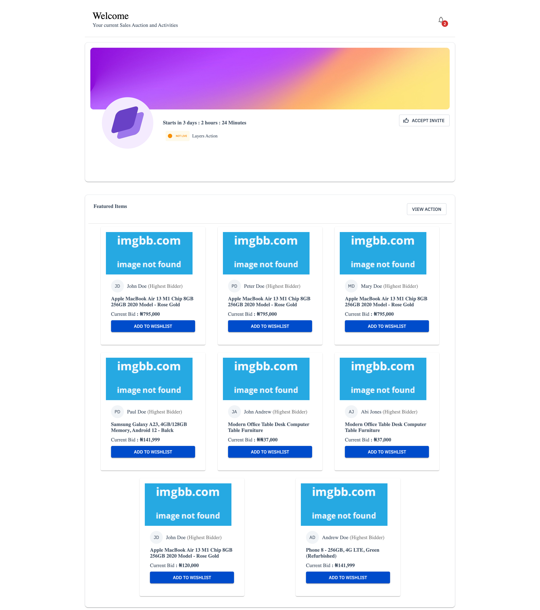

*Rayda Mock*
This a React Project build in React.It uses react query to fetch data and material ui

*Installation

To install this project, make sure you have Node.js and npm installed on your machine. Then, follow these steps:

1.Clone the repository:

`git clone https://github.com/luchetu/Rayda.git`

2.Navigate to the project directory:

3.Install the dependencies:

4.Usage
To run the project, use the following command:

`npm start`

*Contributing*

If you'd like to contribute to this project, please follow these steps:

1.Fork the repository

2.Create a new branch

3.Make your changes and commit them

4.Push your changes to your fork

5.Submit a pull request

**License**
This project is licensed under the MIT License.

